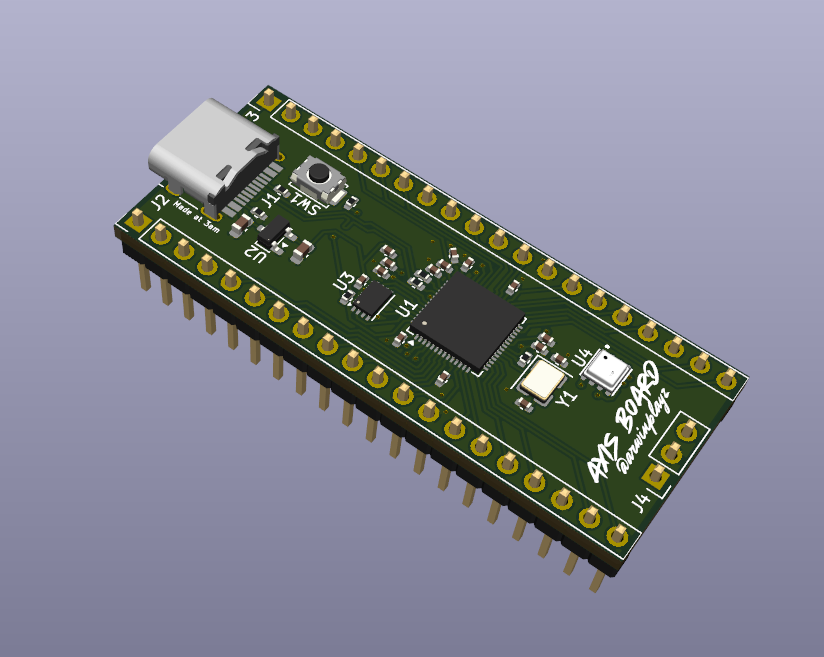
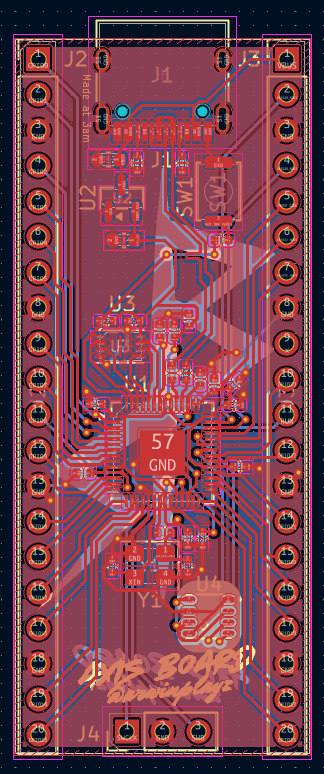
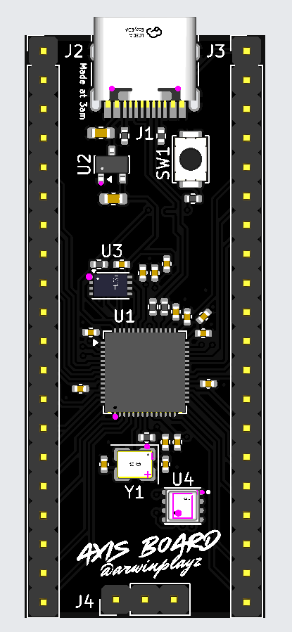
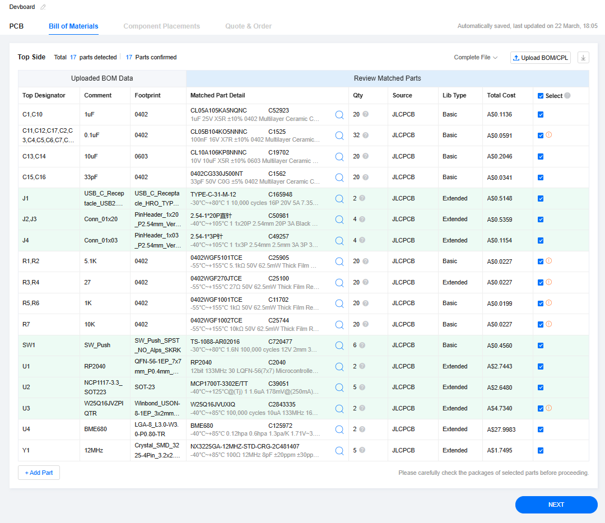

# Custom Devboard
A custom Devboard inspired by the Pico made in kicad
---

## Project Overview
The goal was to create a custom devboard PCB within kicad and learn how they truely work in the process.

---

## Screenshots

### 1. Overall
  

### 2. Schematic
  

### 3. PCB layout
  

### 4. Design
  

### Bill Of Materials
  
