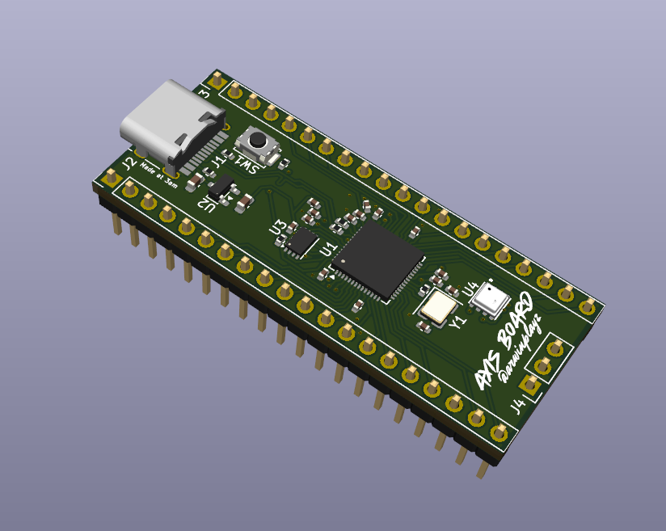
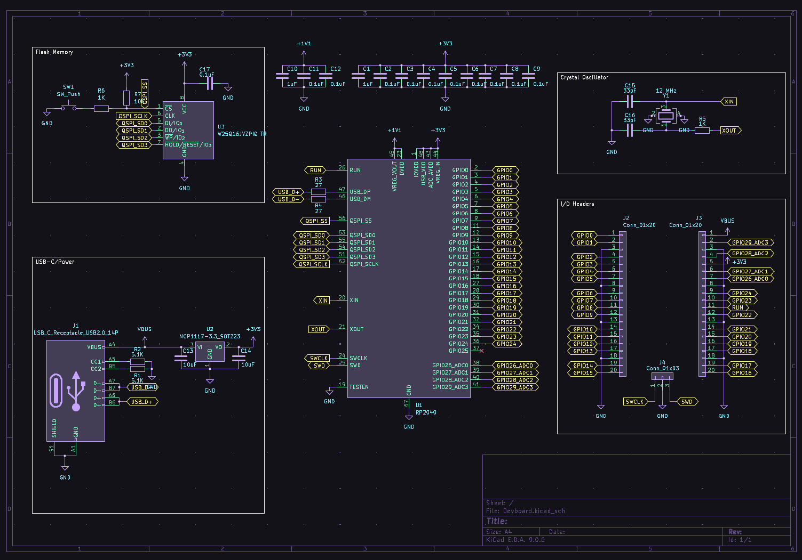
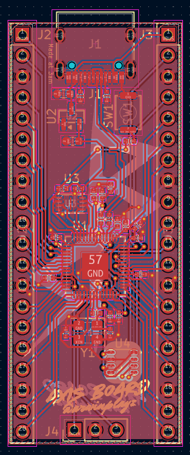
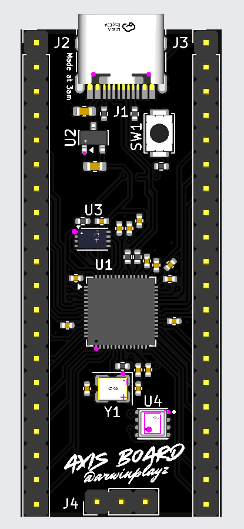
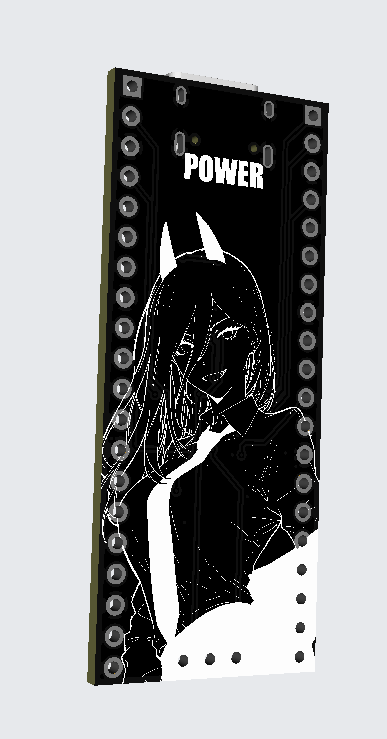
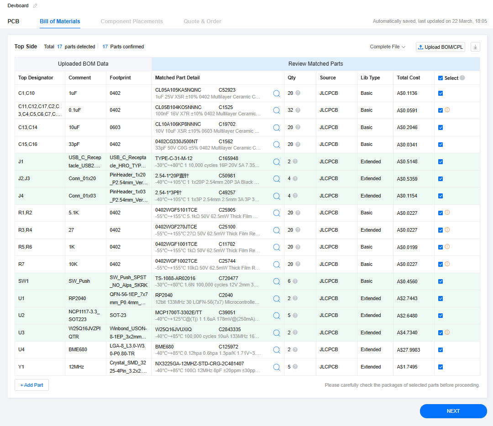

# Custom Devboard
A custom Devboard inspired by the Pico made in kicad
---

## Project Overview
The goal was to create a custom devboard PCB within kicad and learn how they truely work in the process.

This was one of my first projects I did so I truely learnt alot from it. Took some time off due to school and exams but finally managed to fint time to finish. Its multipurpose and fully programable GPIO pins so I look forward to using it alonside some other projects in the future. I decided overall to make this project because it would give me something really useful for future creations. Before this I had not a clue how microcontrollers and devboards worked but now I know so much.

---

## Screenshots

### 1. Overall
  

### 2. Schematic
  

### 3. PCB layout
  

### 4. Design
  

### Bill Of Materials
  
